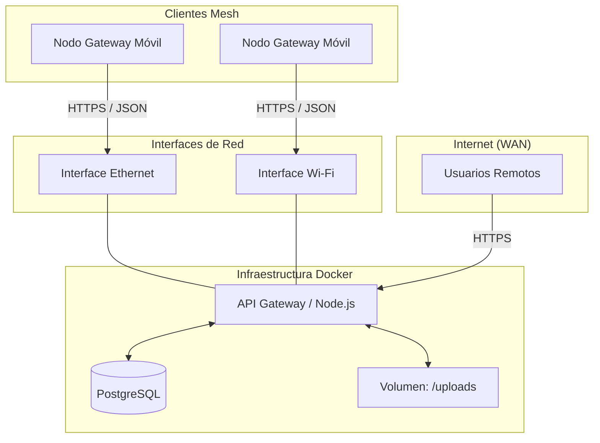
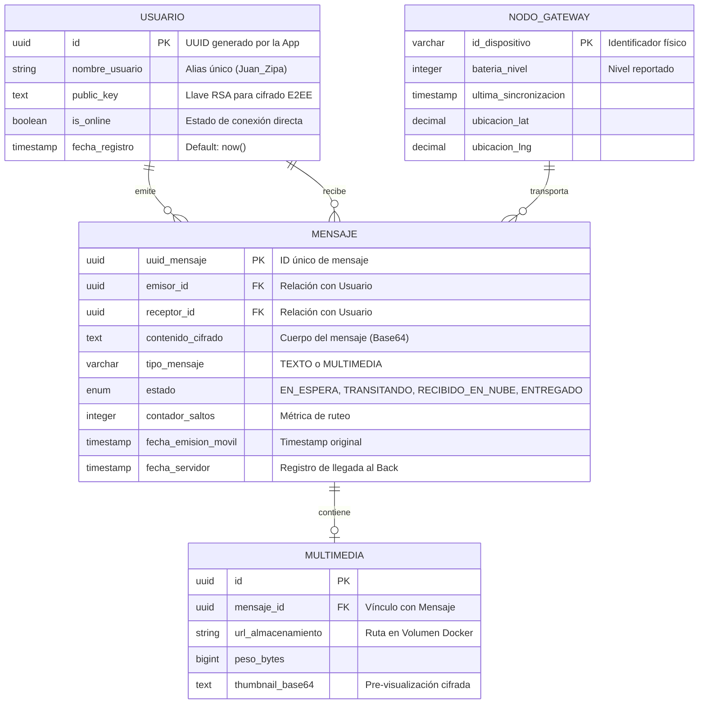
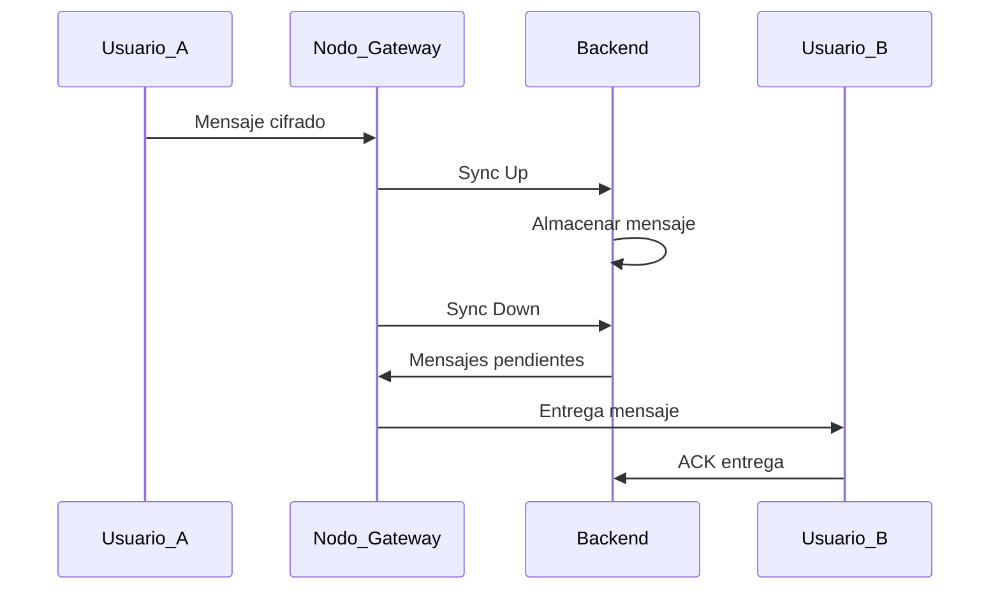

# 📘 Documento Maestro: Especificaciones del Backend - Proyecto Red Mesh

**Versión:** 2.0  
**Líder de Proyecto:** Líder Técnico  
**Estado:** Definición de Arquitectura  
**Tecnología:** Node.js, PostgreSQL, Docker, Swagger  

---

## 1. Introducción y Objetivo
Este componente actúa como el nodo central de persistencia y puente (Bridge) del sistema. Su función primordial es recibir paquetes de datos cifrados de la zona rural (vía Nodos Gateway), almacenarlos y servirlos cuando el destinatario tenga conexión.

**Principio de diseño:** El servidor opera bajo el modelo *Zero-Knowledge* respecto al contenido: solo gestiona metadatos y paquetes cifrados.

Su función es:

#### Recibir mensajes ya cifrados desde dispositivos móviles
#### Almacenarlos sin conocer su contenido (Zero-Knowledge)
#### Gestionar sincronización entre nodos Gateway y nube
#### Servir mensajes cuando los gateways lo soliciten

---

## 2. Arquitectura de Datos (ER Diagram)


## 3. Arquitectura de Datos (ER Diagram)

El esquema de base de datos está diseñado para garantizar la integridad de la mensajería y permitir métricas de trazabilidad de red.



## 4. Seguridad y Flujo de Cifrado (E2EE)

El backend debe cumplir estrictamente con estas reglas de seguridad:

### 🔐 Cifrado en Origen

- Todo mensaje de texto e imagen llega al servidor **ya cifrado desde el móvil**
- El backend **nunca ve el contenido en texto plano**

---

### 🔑 Manejo de Llaves

- El servidor solo almacena la **public_key**

Bajo ninguna circunstancia el backend:

- Genera llaves privadas  
- Almacena llaves privadas  
- Accede a contenido descifrado  

---

### 🖼️ Multimedia Cifrada

- Las imágenes se reciben como archivos binarios `.enc`

El servidor:

- No valida formato de imagen  
- No descifra contenido  
- Solo actúa como repositorio de archivos cifrados  

---

## 5. Definición de Endpoints (API REST)

| Método | Ruta | Propósito | Payload Requerido |
|--------|------|-----------|-------------------|
| POST | `/api/v1/users/register` | Registro de usuario y llave pública | `{ id, nombre_usuario, public_key }` |
| POST | `/api/v1/sync/up` | Gateway sube mensajes de la malla | `{ gateway_id, batch_messages: [...] }` |
| POST | `/api/v1/gateways/heartbeat` | Estado del gateway | `{ gateway_id, staus }` |
| GET | `/api/v1/sync/down/{gw_id}` | Gateway descarga mensajes pendientes | N/A |
| POST | `/api/v1/messages/ack` | Confirmación de entrega final | `{ uuid_mensaje, receptor_id }` |

## 6 Flujo General del Sistema




## 7. Estados del Mensaje

| Estado | Descripción |
|--------|------------|
| EN_ESPERA | Mensaje creado pero no sincronizado |
| TRANSITANDO | En movimiento entre nodos |
| RECIBIDO_EN_NUBE | Guardado en backend |
| ENTREGADO | Confirmado por receptor |

---

## 8. Reglas de Negocio

### 📦 Mensajes
- UUID generado en el cliente  
- Timestamp generado en el cliente  
- Backend agrega timestamp del servidor  

---

### 📡 Gateway
- Puede enviar múltiples mensajes en batch  
- Debe enviar métricas de batería y ubicación  

---

### 📊 Métricas
- Contador de saltos  
- Latencia de entrega  
- Tiempo de almacenamiento  

---

## 9. Stack Tecnológico

### Backend
- Node.js  
- Express / Fastify  
- Swagger (OpenAPI)  

### Base de Datos
- PostgreSQL  
- UUID nativo  
- JSONB para metadata  

### Infraestructura
- Docker  
- Docker Compose  
- Volumen persistente para multimedia  

---

## 10. Estructura del Proyecto

```text
backend-red-mesh/
│
├── src/
│   ├── controllers/
│   ├── services/
│   ├── repositories/
│   ├── models/
│   ├── routes/
│   └── middleware/
│
├── docker/
├── docs/
├── swagger/
├── .env
├── docker-compose.yml
└── package.json

```

## 11. HITOS DEL PROYECTO (PLAN DE TRABAJO)


---

### 🧩 HITO 1: Inicialización del Backend
**Responsable:** Estudiante A o B  

**Actividades:**
* Configuración **Node.js** + Express/Fastify.
* Definición de estructura de carpetas.
* Configuración **Docker + Docker Compose**.
* Swagger base funcional.
* Variables de entorno (`.env`).

**Entregables:**
* [ ] Backend levantando en Docker.
* [ ] Swagger accesible.

---

### 🧩 HITO 2: Base de Datos y Modelo
**Responsable:** Estudiante A o B  

**Actividades:**
* Diseño final **PostgreSQL**.
* Gestión de migraciones.
* Definición de relaciones entre tablas e índices básicos.

**Entregables:**
* [ ] Base de datos persistente.
* [ ] Modelo relacional funcional.

---

### 🧩 HITO 3: Registro de Usuarios y Gateways
**Actividades:**
* Endpoint de registro de usuario.
* Endpoint de **heartbeat** para gateways.
* Validaciones básicas y control de duplicados.

**Entregables:**
* [ ] Usuarios registrados.
* [ ] Gateways activos monitoreados.

---

### 🧩 HITO 4: Sistema de Mensajería (CORE)
**Actividades:**
* Recepción de mensajes cifrados.
* Persistencia en base de datos.
* Gestión de estados del mensaje y **Batch processing**.

**Entregables:**
* [ ] Mensajes almacenados correctamente.
* [ ] Flujo básico de estado funcional.

---

### 🧩 HITO 5: Sincronización Mesh ↔ Backend
**Actividades:**
* **Sync UP** (gateway → backend).
* **Sync DOWN** (backend → gateway).
* Manejo de lotes y control de duplicados.

**Entregables:**
* [ ] Flujo completo de sincronización.

---

### 🧩 HITO 6: Multimedia Cifrada
**Actividades:**
* Recepción de archivos `.enc`.
* Almacenamiento en volumen **Docker**.
* Relación lógica con mensajes.

**Entregables:**
* [ ] Archivos cifrados almacenados correctamente.

---

### 🧩 HITO 7: Confirmación de Entrega (ACK)
**Actividades:**
* Endpoint de confirmación.
* Cambio a estado **ENTREGADO**.
* Registro de métricas simples.

**Entregables:**
* [ ] Mensaje con ciclo de vida completo.

---

### 🧩 HITO 8: Validación Final del Sistema
**Actividades:**
* Pruebas de endpoints.
* Simulación de flujo completo y validación de estados.
* Pruebas de carga básicas.

**Entregables:**
* [ ] Reporte de validación final.

## 12. Checklist de Validación (Criterios de Aceptación)

Este checklist debe cumplirse al 100% para considerar el hito de Backend como finalizado.

### ✅ Estándares de Código y Documentación
- [ ] **Swagger Activo:** La documentación en `/api-docs` está actualizada y permite probar todos los endpoints.
- [ ] **Manejo de Errores:** Todos los endpoints devuelven códigos HTTP estándar (400 para errores de cliente, 500 para servidor, 404 para no encontrado).
- [ ] **Variables de Entorno:** No existen credenciales quemadas en el código; todo se maneja vía `.env`.

### ✅ Infraestructura y Docker
- [ ] **Dockerización:** El comando `docker-compose up --build` levanta el sistema completo sin configuraciones manuales previas.
- [ ] **Persistencia:** Al eliminar el contenedor con `docker-compose down`, los datos de la DB y las imágenes multimedia permanecen intactos al volver a levantar.
- [ ] **Network Mode:** Se verificó que el servidor es visible desde otros dispositivos usando la IP del host (gracias a `network_mode: host`).

### ✅ Integridad de Datos y Seguridad
- [ ] **Zero-Knowledge:** Se confirmó que el servidor puede almacenar y entregar mensajes sin necesidad de conocer las llaves privadas de los usuarios.
- [ ] **Integridad Multimedia:** Las imágenes subidas mantienen su tamaño original y no se corrompen durante la transferencia.
- [ ] **Consistencia de Estados:** Un mensaje cambia de `EN_ESPERA` a `TRANSITANDO` inmediatamente después de ser entregado exitosamente a un Gateway en el `Sync Down`.

### ✅ Métricas de Ingeniería
- [ ] **Cálculo de Latencia:** El sistema registra correctamente tanto el `fecha_emision_movil` como el `fecha_servidor`.
- [ ] **Contador de Saltos:** El campo `contador_saltos` se actualiza o persiste correctamente según el envío del Gateway.

