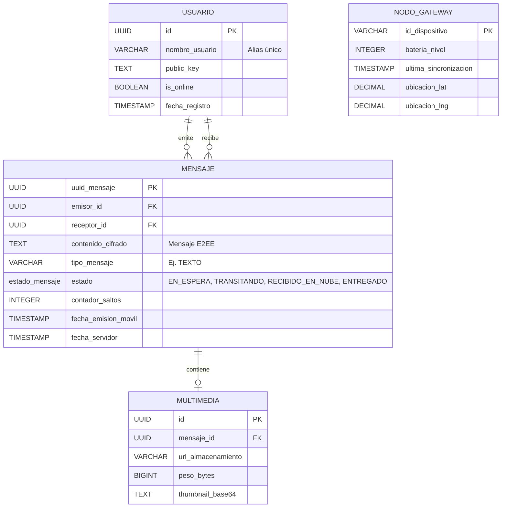

# 📘 Documentación del Backend - Proyecto Red Mesh

**Tecnología:** Node.js, Express, TypeScript, PostgreSQL, Docker, Swagger  
**Estado:** Activo

---

## 🚀 Pasos para Ejecutar el Proyecto

El backend está preparado con Docker y Docker Compose para facilitar su despliegue y configuración sin necesidad de instalar dependencias localmente, a excepción de Docker.

### Opción 1: Ejecución con Docker (Recomendado)

1. **Requisitos previos**: Asegúrate de tener instalado [Docker](https://www.docker.com/) (las versiones recientes incluyen el comando integrado `docker compose`).
2. **Configuración de variables de entorno**: 
   Asegúrate de contar con un archivo `.env` en la raíz de la carpeta `Backend/`. Puedes crearlo basándote en el archivo de ejemplo (si existe):
   ```bash
   cp .env.example .env
   ```
3. **Construir y levantar los contenedores**:
   En la raíz del directorio `Backend/`, ejecuta el siguiente comando para levantar el entorno en segundo plano (`-d`):
   ```bash
   docker compose up --build -d
   ```
   *(Si deseas ver los logs en tiempo real, puedes quitar el `-d` del comando).*
4. **Verificar el servidor**:
   Una vez iniciados los servicios, comprueba su funcionamiento:
   - **Backend**: `http://localhost:3001`
   - **Documentación Swagger**: `http://localhost:3001/api-docs`
   - **Estado (Health check)**: `http://localhost:3001/api/health`

5. **Detener la ejecución**:
   Cuando desees apagar los contenedores instalados, simplemente ejecuta:
   ```bash
   docker compose down
   ```

### Opción 2: Ejecución local para desarrollo (Nativa)

Si deseas correr el servidor fuera de Docker directamente en tu entorno local con Node.js:

1. **Requisitos previos**: [Node.js](https://nodejs.org/), base de datos PostgreSQL en ejecución local y configuración del `.env` ajustada a los puertos locales.
2. **Instalar dependencias**:
   ```bash
   npm install
   ```
3. **Inicializar base de datos**:
   Puedes ejecutar manualmente el script `./docker/init.sql` en tu instancia de PostgreSQL.
4. **Modo Desarrollo (con auto-recarga)**:
   ```bash
   npm run dev
   ```
5. **Modo Producción**:
   ```bash
   npm run build
   npm start
   ```

---

## 1. Introducción y Objetivo

Este backend sirve como puente central (Bridge) para el Proyecto Red Mesh. Recibe y sincroniza los paquetes de mensajes encriptados provenientes desde los Nodos Gateway de zonas rurales, para luego ponerlos a disponibilidad del destinatario final gracias a su conectividad con internet.

**Principio de diseño Zero-Knowledge:** El servidor no ve el contenido de la comunicación, ya que se encarga del manejo de *metadatos*, recibiendo y sincronizando paquetes seguros (Base64) encriptados de extremo a extremo.

---

## 2. Arquitectura de Datos (ER Diagram)

La base de datos estructurada en PostgreSQL persiste a los usuarios, el estado de los nodos, los mensajes en estado Zero-Knowledge y las vistas multimedia. A continuación, el esquema real de la base de datos derivado de `init.sql`:



---

## 3. Seguridad y Flujo de Cifrado (E2EE)

- **Cifrado en Origen:** El backend nunca ve un mensaje de texto plano, cada mensaje llega cifrado desde el emisor.
- **Manejo de Llaves:** Para operar, el backend solo almacena de lado público la `public_key` del usuario, no administra ni accede a las llaves privadas.
- **Archivos Multimedia:** Son registrados por URL y peso. Su contenido no es validado mediante algoritmos intrusivos del backend ni son descifrados en la memoria del servidor. Se conservan mediante los volúmenes del entorno de ejecución Docker.

---

## 4. Estructura de Endpoints Base

La API emplea los siguientes prefijos registrados mediante rutas anidadas en `src/index.ts`:

- `/api/usuarios` o `/api/v1/users` - Gestión y Registro de Usuarios.
- `/api/gateways` o `/api/v1/gateways` - Heartbeat y estados de Nodos Gateway móviles.
- `/api/sync` o `/api/v1/sync` - Sync DOWN / UP entre dispositivos y malla.
- `/api/messages` o `/api/v1/messages` - Ciclo y confirmación (ACK) de mensajes individuales.
- `/api/multimedia` o `/api/v1/multimedia` - Recepción de blobs y thumbnails.
- `/api/health` - Comprobación rápida del estado del servidor.

Consulta Swagger en `/api-docs` durante la ejecución para evaluar el payload exacto de cada ruta.

---

## 5. Organización y Estructura del Código

El backend en lugar de usar un monolito rígido, emplea un enfoque orientado a Dominio (Controller/Service/Repository) propuesto para limpieza en código TypeScript.

```text
Backend/
│
├── src/
│   ├── config/          # Variables y conexión DB (pool)
│   ├── controllers/     # Toma requests delegando en servicios (Gateway, User, etc.)
│   ├── models/          # Entidades para tipado TypeScript
│   ├── repositories/    # Consultas RAW a Postgres (pool.query)
│   ├── routes/          # Declaración de Endpoints base
│   ├── services/        # Capa de Lógica de Negocio
│   └── index.ts         # Orquestación (Express Server)
│
├── docker/              
│   └── init.sql         # Base de Datos Seed inicial
├── swagger/             
│   └── swagger.yaml     # Autodocumentación API Completa
├── Dockerfile           # Script de imagen
├── docker-compose.yml   # Multi-Contenedor API + DB
└── package.json         # Dependencias NodeJS
```
