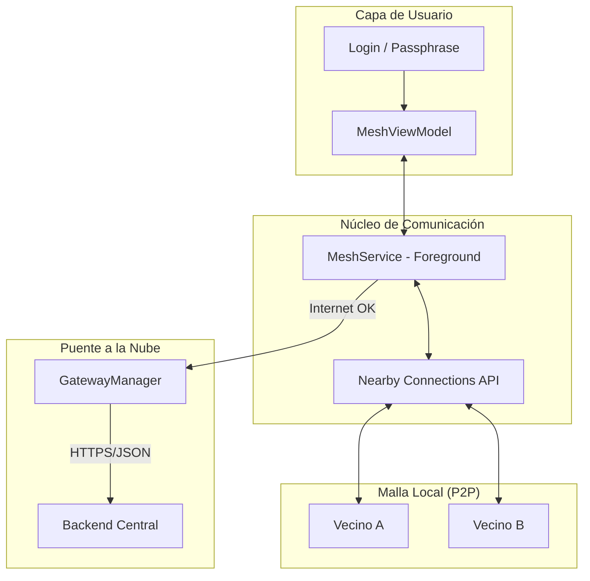
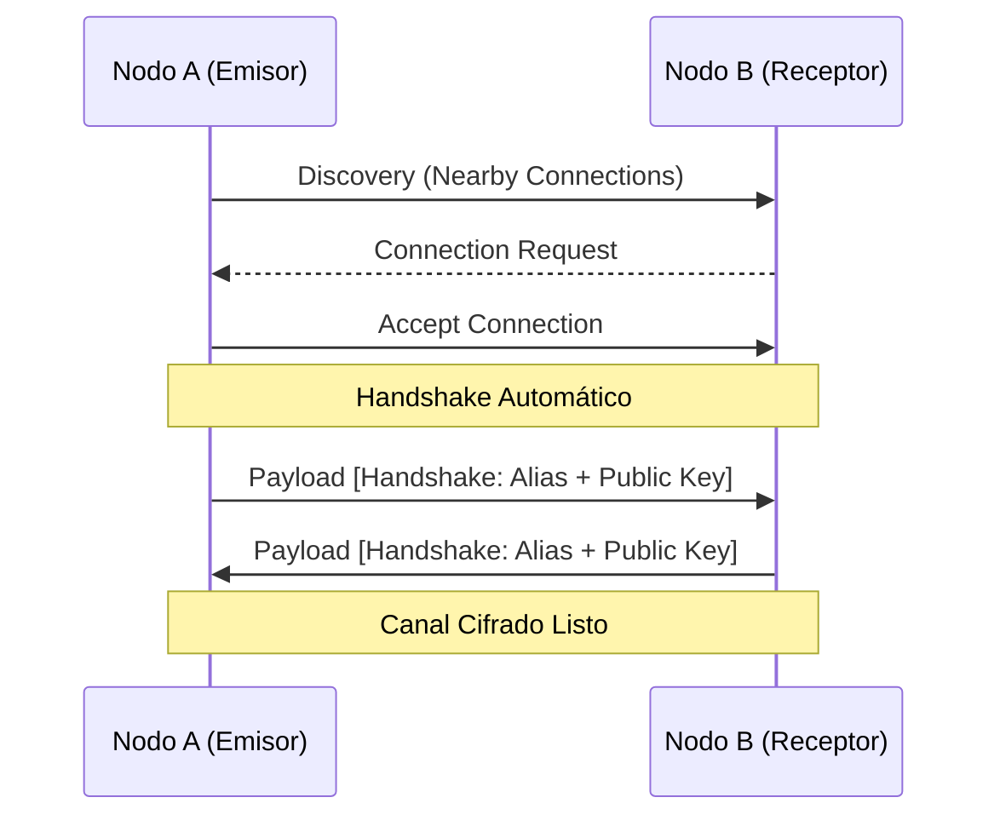
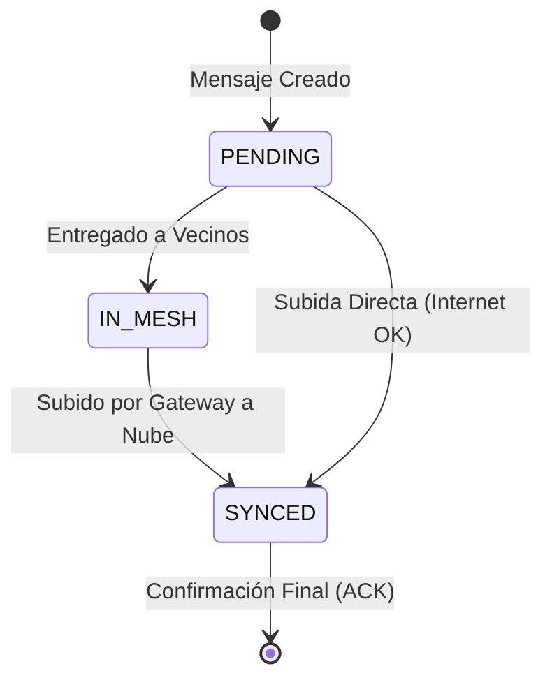
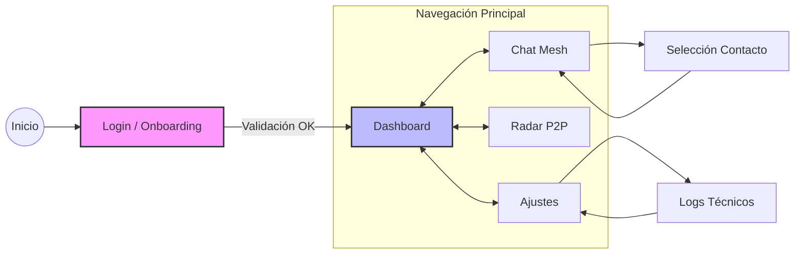

# 📱 Documento Maestro: Especificaciones de la App Móvil - MeshApp

**Versión:** 2.0  
**Estado:** Implementación y Refuerzo de Identidad  
**Tecnología:** Kotlin, Google Nearby Connections, Room, Retrofit, RSA/AES  

---

## 1. Introducción y Objetivo
Esta aplicación es el componente cliente y nodo activo de la **Red Mesh**. Su función es permitir la mensajería P2P sin dependencia de internet, actuando además como un agente de transporte (Gateway) si detecta conectividad.

**Principio de diseño:** Privacidad absoluta mediante cifrado extremo a extremo (E2EE) y soberanía de identidad mediante derivación por frase de recuperación.

Sus funciones principales son:
#### Generar identidades seguras basadas en Passphrase
#### Descubrir y conectar con vecinos mediante Bluetooth/Wi-Fi Direct
#### Cifrar, enviar y retransmitir mensajes en la malla
#### Actuar como Gateway reactivo ante disponibilidad de Internet

---

## 2. Requisitos Funcionales (RF) Detallados

### RF-01: Sistema de Identidad Autónoma y Recuperación
- **Descripción**: El usuario debe poder generar una identidad digital única sin depender de un servidor central de autenticación.
- **Mecanismo**: Implementación de una función determinista que utiliza el `Alias` y una `Passphrase`. Mediante un hash SHA-256, se deriva un `NodeID` (UUID) y un par de llaves `RSA-2048`.
- **Criterio**: Si el usuario introduce la misma combinación en un dispositivo nuevo, la App debe generar exactamente la misma identidad, permitiendo la recuperación de su "buzón" de mensajes en el backend.

### RF-02: Descubrimiento y Conectividad P2P Omnidireccional
- **Descripción**: La app debe descubrir vecinos de forma proactiva y establecer canales de comunicación sin intervención manual.
- **Mecanismo**: Uso de la librería Google Nearby Connections con estrategia `P2P_STAR`. El `MeshService` actúa simultáneamente como *Advertiser* y *Discoverer*.
- **Criterio**: Dos dispositivos a menos de 10-20 metros deben establecer un "Handshake" automático en menos de 5 segundos.

### RF-03: Mensajería con Cifrado de Extremo a Extremo (E2EE)
- **Descripción**: Garantizar que solo el emisor y el receptor puedan leer el contenido del mensaje.
- **Mecanismo**: Cifrado híbrido. El cuerpo del mensaje se cifra con `AES-128` (llave simétrica aleatoria). Esta llave AES se cifra con la `Llave Pública RSA` del receptor obtenida durante el Handshake.
- **Criterio**: El paquete transmitido (`EncryptedKey|EncryptedContent`) debe ser indescifrable para nodos intermedios o el administrador del backend.

### RF-04: Almacenamiento y Retransmisión (Store-and-Forward)
- **Descripción**: Los mensajes deben persistir y rutease a través de la malla hasta encontrar una salida (internet) o el destino.
- **Mecanismo**: Uso de `Room Database`. Los mensajes marcados como `PENDING` se envían a todos los vecinos conectados. Los nodos intermedios guardan y retransmiten mensajes de terceros sin poder leerlos.
- **Criterio**: Un mensaje debe poder saltar entre al menos 3 nodos antes de llegar a un nodo con internet (Gateway).

### RF-05: Gateway Móvil Reactivo
- **Descripción**: Cualquier nodo con acceso a datos móviles o Wi-Fi debe subir los mensajes de la malla a la nube.
- **Mecanismo**: El `GatewayManager` monitorea el estado de red. Al detectar internet, envía lotes (`SyncUpRequest`) al endpoint `/sync/up` del backend central.

---

## 3. Requisitos No Funcionales (RNF) Detallados

### RNF-01: Integridad y Modelo Zero-Knowledge
- **Especificación**: El sistema debe garantizar que el backend es un simple repositorio de "blind data" (datos ciegos).
- **Detalle Técnico**: Aunque el backend gestione los metadatos (quién envía a quién), no posee la llave privada para descifrar el `contenido_cifrado`. La integridad se mantiene porque los paquetes están firmados o estructurados de forma que si se alteran, el descifrado RSA fallará en el destino.

### RNF-02: Eficiencia de Recursos y Batería
- **Especificación**: El servicio de malla debe ser sostenible para uso prolongado en dispositivos móviles.
- **Detalle Técnico**: El `MeshService` utiliza un `Foreground Service` optimizado. Se implementan pausas inteligentes en el escaneo de Bluetooth Low Energy (BLE) y Wi-Fi Direct para reducir el consumo energético sin perder la conectividad de la malla.

### RNF-03: Persistencia y Tolerancia a Fallos
- **Especificación**: Cero pérdida de datos ante reinicios o cierres inesperados de la aplicación.
- **Detalle Técnico**: Implementación de `Room` con transacciones ACID. El estado de cada mensaje (`PENDING`, `IN_MESH`, `SYNCED`) es persistente, asegurando que la sincronización se reanude automáticamente al reiniciar la app.

### RNF-04: Usabilidad y Feedback de Sincronización
- **Especificación**: El usuario debe conocer el estado real de sus comunicaciones en entornos de baja conectividad.
- **Detalle Técnico**: La interfaz de chat muestra indicadores visuales del estado del mensaje. El `RadarFragment` proporciona una representación gráfica de la topología local (cuántos vecinos hay cerca).

---

## 4. Arquitectura de Conectividad (Flowchart)



---

## 5. Protocolo P2P (Handshake Sequence)

El intercambio de llaves es crítico para habilitar el cifrado E2EE antes del primer mensaje.



---

## 6. Estado del Mensaje (State Diagram)

El ciclo de vida de un mensaje garantiza que nunca se pierda un dato, incluso en entornos altamente volátiles.



---

## 7. Grafo de Navegación (App Navigation Flow)

Estructura de pantallas y flujos de usuario definidos en el `nav_graph.xml`.



---

## 8. Seguridad y Flujo de Cifrado (Zero-Knowledge)

La App es la única que posee las llaves para descifrar el contenido.

### 🔐 Cifrado E2EE
- **Mensajes**: Texto plano + Llave Pública del Receptor -> Cifrado AES-128 (Contenido) + Cifrado RSA-2048 (Llave AES).
- **Identidad**: El `Node ID` se deriva mediante un hash SHA-256 de la frase de recuperación, asegurando que el usuario pueda recuperar su cuenta en cualquier dispositivo.

### 🔑 Gestión de Llaves
- La llave privada se mantiene en la memoria segura de la app.
- Solo la llave pública se registra en el backend para permitir que otros usuarios envíen mensajes cifrados.

---

## 9. Estructura del Código

```text
app/src/main/java/com/example/appmesh/
├── LoginFragment.kt    # Onboarding e Identidad
├── ChatFragment.kt     # Mensajería E2EE
├── DashboardFragment.kt # Estado de Red y Sincronización
├── service/
│   └── MeshService.kt  # Gestión Proactiva de la Malla
├── network/
│   ├── ApiService.kt   # Endpoints V2.0
│   └── GatewayManager.kt # Lógica de Bridge Malla-Nube
|   └── Nearby.kt # Lógica Nearby 
└── utils/
    ├── SecurityUtils.kt # Criptografía RSA/AES
    └── PayloadHelper.kt # Protocolo de Handshake
```

---

## 10. HITOS DEL PROYECTO (PLAN DE TRABAJO)

### 🧩 HITO 1: Core de Identidad
- [x] Derivación determinista de ID/Keys por Passphrase.
- [x] Pantalla de Login/Onboarding con validación de Alias.
- [x] Persistencia de identidad en SharedPreferences.

### 🧩 HITO 2: Comunicación P2P (Nearby)
- [x] Implementación de P2P_STAR strategy.
- [x] Handshake automático (Intercambio de Alias/Keys).
- [x] Radar de vecinos en tiempo real.

### 🧩 HITO 3: Mensajería y Cifrado
- [x] Cifrado/Descifrado Híbrido funcional.
- [x] Filtrado de privacidad en base de datos (Room).
- [x] Interfaz de chat reactiva.

### 🧩 HITO 4: Integración Backend (Sync)
- [x] Alineación de modelos con API V2.0.
- [x] Gateway Manager con notificaciones de sincronización.
- [x] Fix de Cleartext Traffic para redes locales.

---

## 11. Checklist de Validación (Criterios de Aceptación)

- [ ] **Persistencia**: Al reinstalar la app con la misma frase, el ID del nodo debe ser idéntico.
- [ ] **E2EE**: Los mensajes en la base de datos `messages` deben ser ilegibles si no eres el destinatario.
- [ ] **Malla**: Un dispositivo sin internet debe enviar un mensaje que rutee a través de un vecino con internet.
- [ ] **Sincronización**: El estado del mensaje debe cambiar a `SYNCED` tras el reporte exitoso del `GatewayManager`.

